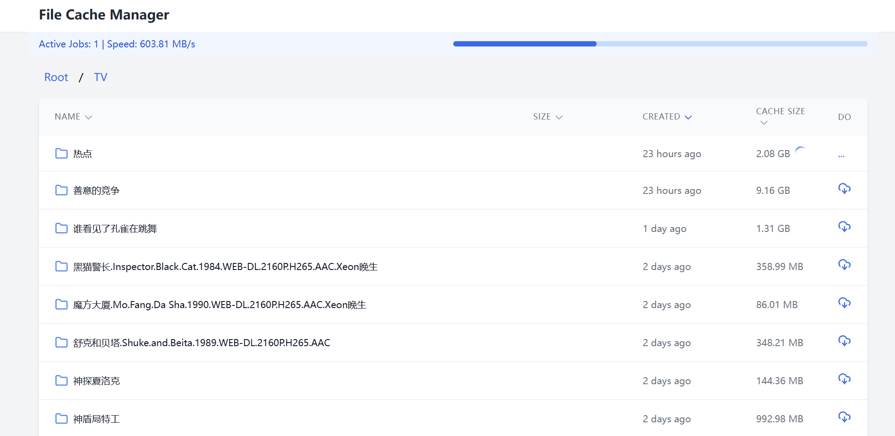

# File Cache Manager

Actively precache a rclone mount that has VFS cache.

Disclaimer: AI generated README and most of the code.

File Cache Manager is a web-based application that helps manage and monitor file caching between a network mount and a local VFS cache. It provides an intuitive interface for browsing files and directories, precaching content, and monitoring cache status in real-time.





## Features

- **File Browser**: Browse files and directories on the network mount
- **Cache Management**: Precache files and directories recursively
- **Real-time Monitoring**: Track precaching progress and speed
- **Cache Size Analysis**: View actual cache sizes of files and directories
- **Sparse File Support**: Properly handles sparse files in the cache

## Architecture

The application consists of two main components:

1. **Backend (Go)**
   - Built with Gin web framework
   - Handles file system operations
   - Manages cache operations
   - Provides REST API endpoints

2. **Frontend (React)**
   - Single-page application
   - Real-time progress monitoring
   - Responsive file browser interface
   - Built with Tailwind CSS for styling

## Installation

1. Clone the repository:
```bash
git clone [repository-url]
cd rclone-precache
```

2. Build the application:
```bash
go build
```

## Configuration

The application requires two main path configurations:

- `PATH1`: The network mount path
- `PATH2`: The VFS cache path

Example configuration:
```bash
./rclone-precache -mount /path/to/network/mount -cache /path/to/vfs/cache
```

## API Endpoints

### Browse Files
```
GET /api/browse/*path
```
Returns list of files and directories with their metadata.

### Start Precaching
```
POST /api/precache/*path
```
Initiates precaching for a file or directory.

### Monitor Cache Progress
```
GET /api/cache-progress/*path
```
Returns current precaching progress and statistics.

## Features in Detail

### File Browser
- Displays file/directory names
- Shows file sizes
- Shows creation dates
- Indicates cache status
- Supports navigation through directories

### Precaching
- Recursive precaching for directories
- Progress monitoring
- Speed measurements
- Efficient handling of large files
- Sparse file support

### Cache Monitoring
- Real-time progress updates
- Cache size tracking
- Transfer speed monitoring
- Global progress overview

## Technical Details

### Sparse File Handling
The application correctly handles sparse files in the cache, reporting actual disk usage rather than apparent file size.

### Large File Support
Files are processed in chunks to maintain memory efficiency:
- No full file loading into memory
- Sequential read operations
- Progress tracking per chunk

### Real-time Updates
- WebUI updates continuously during precaching
- Shows current transfer speeds
- Displays overall progress
- Updates cache sizes dynamically

## Browser Support

The web interface is compatible with modern browsers:
- Chrome/Chromium
- Firefox
- Safari
- Edge

## Development

### Prerequisites
- Go 1.16 or later
- Node.js 14 or later (for frontend development)
- Network mount and VFS cache setup

### Building from Source
1. Build the backend:
```bash
go build
```

2. Build the frontend (if modifying):
```bash
cd frontend
npm install
npm run build
```

## License

[Your License Here]

## Contributing

1. Fork the repository
2. Create your feature branch
3. Commit your changes
4. Push to the branch
5. Create a new Pull Request
